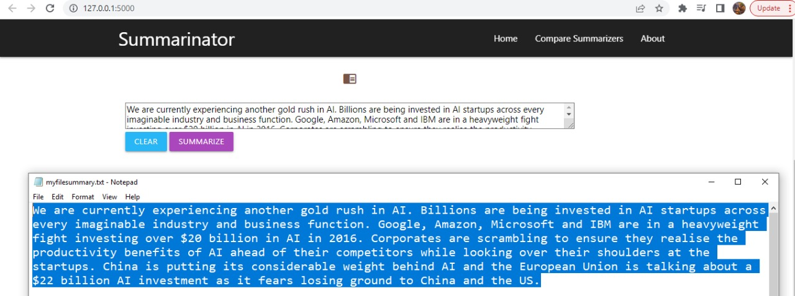
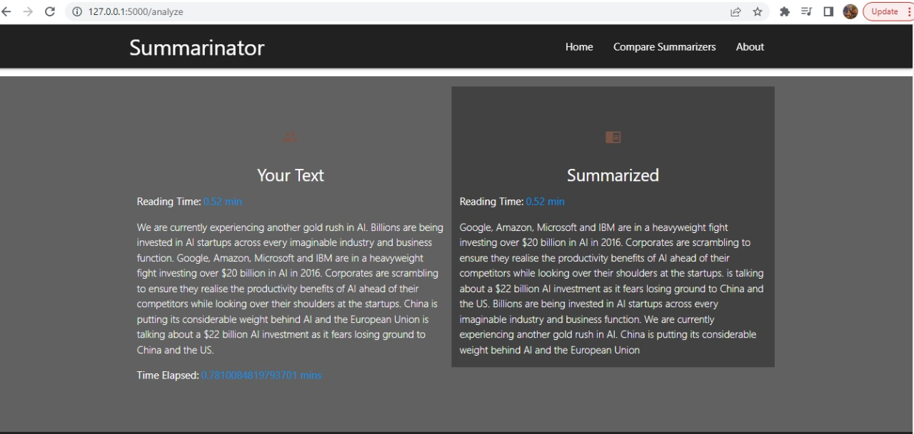
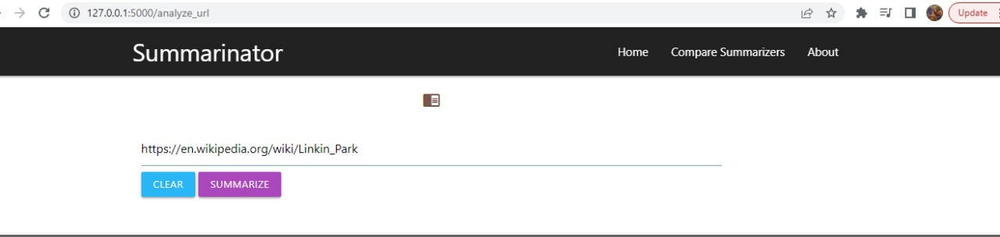
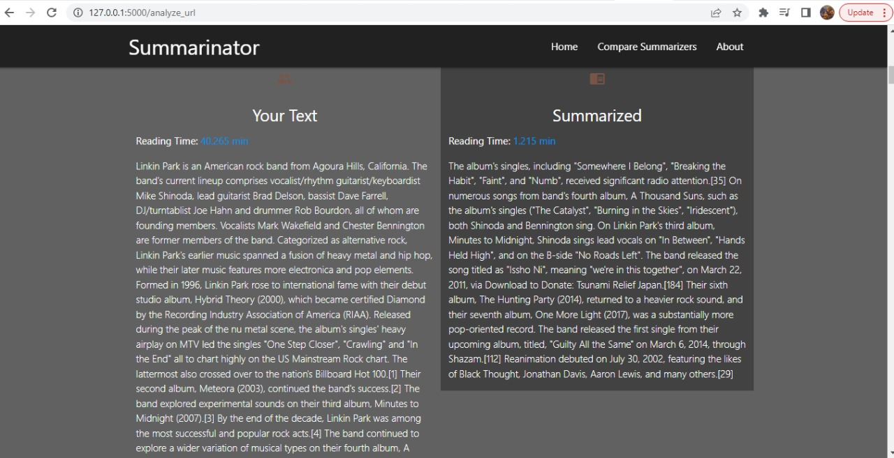
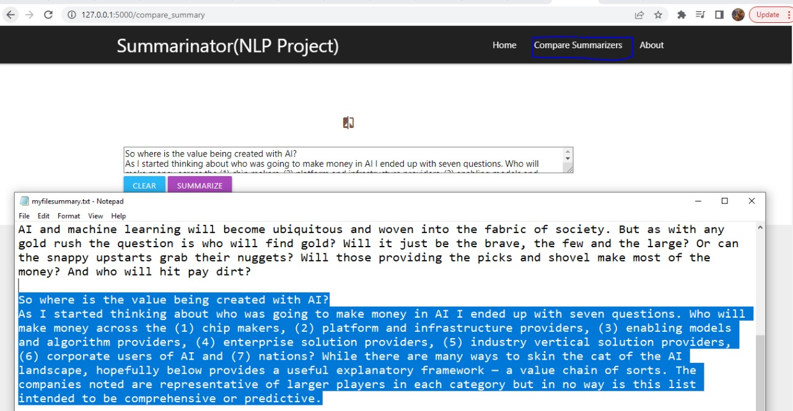
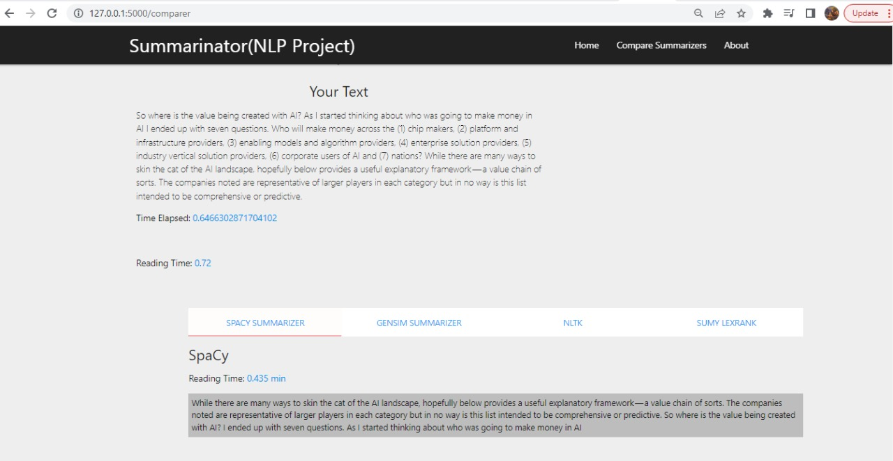
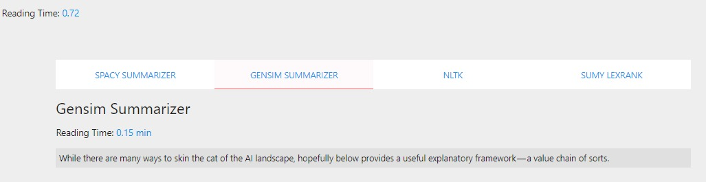
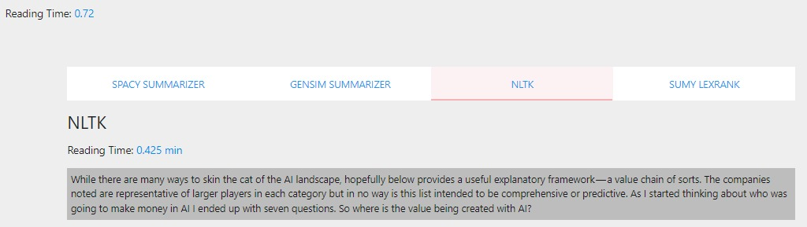
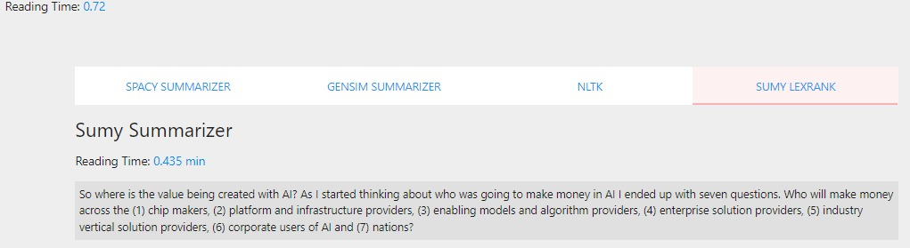

#### Summarinator Text/Data summerizer web application deployed on Flask Server
+ Summarinator : simply text/ document summarization web application implemented using Flask.
	- Using Spacy,Sumy,Gensim and NLTK
	- Fetch text from url and summarize
	- Summarize files as well as links
	- Compare various summarizers

##### Tools used
- Python 
- Google Collab
For Extractive:
- Spacy
- NLTK
- Gensim
- Sumy
For Abstractive:
- T5 Model (Text-To-Text Transfer Transformer)

##### Screenshot

##### Simple Summary

##### Works with Url

##### Url Summarize

##### Compare Summarizers

##### Spacy summarizer summary

##### genism summarizer summary

##### NLTK summary

##### Sump lexrank summary

##### .
- By Muhammad Raamish Alam(20k-1326), Muhammad Ashar Ansari(20k-1409), Muzammil Ahmed(20k-1394)
- Submitted to Sr Raza Abbas
- NLP DS 5007

